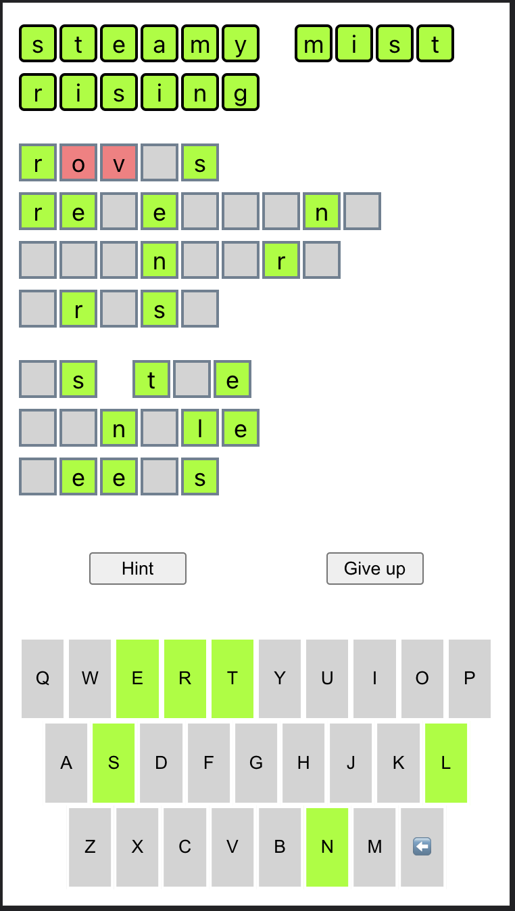

# Haikudle - [play me!](https://haikudle.pages.dev)

This is a daily puzzle game inspired by [wordle](https://www.nytimes.com/games/wordle/index.html).

The haikus are sourced from https://www.kaggle.com/datasets/bfbarry/haiku-dataset